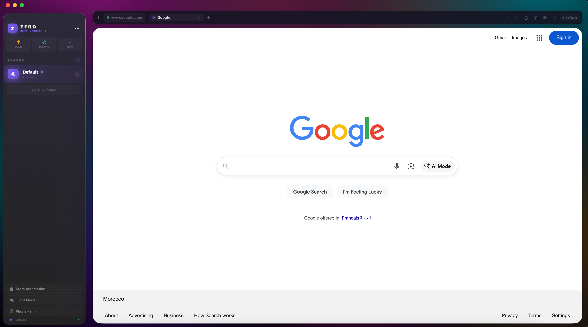
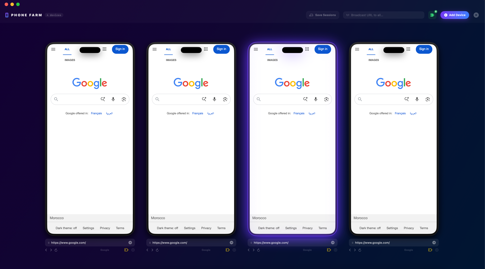

  
  
  <h1 style="font-size: 3em; margin-bottom: 0;">Zero Browser</h1>
  
<b>Browse Zero. Do More.</b>

  
The multi-account automation powerhouse built natively for macOS.

   

  
  
  

    
  
  

    <i>The browser that connects to the internet, not our servers.</i>
  

---

 

  

 

## ✨ Crafted for Professionals

Welcome to **Zero Browser** — engineered from the ground up for power users who demand uncompromising speed, absolute isolation, and total control over their digital workflow. We believe in raw performance and zero telemetry.

### 🌐 Unlimited Profiles
Create and switch between completely isolated browser profiles instantaneously. Each profile acts as a fresh, independent machine maintaining its own cookies, storage, extensions, and unique fingerprint.

### 📱 Phone Farm Command Center
Scale your operation effortlessly. Monitor your phone farm through a stunning, unified `4×N` grid dashboard. Control sessions, manage activity, and deploy updates without breaking a sweat.

### 🔒 Zero Leaks
Military-grade profile isolation ensures absolute privacy. Your fingerprint, cookies, and session data are hermetically sealed. Your accounts stay permanently separated, guaranteeing zero cross-contamination.

### 🤖 Automation Ready
Built-in native support for powerful automation workflows. Run complex, repetitive tasks across multiple isolated accounts simultaneously — completely eliminating the risk of data bleed.

### ⚡ Native macOS Speed
Hyper-optimized natively for both Apple Silicon and Intel. Experience blazing-fast tab loads, buttery-smooth scrolling, and a drastically reduced memory footprint compared to traditional browsers.

 

---

 

## 📸 The Command Center

  
    
  
<em>The Phone Farm Dashboard — Control dozens of isolated sessions simultaneously.</em>

 

---

 

## 🚀 Instant Deployment

Zero Browser is designed for instant productivity. No complex setup or learning curve required.

1. **Download:** Grab the latest `.dmg` from our [Releases Page](https://github.com/ZeroBrowserCompany/ZeroBrowserCompany.github.io/releases). Fits both Intel and Apple Silicon natively.
2. **Install:** Drag and drop Zero Browser into your `Applications` folder.
3. **Isolate:** Set up completely separate profiles for each of your personas or tasks.
4. **Scale:** Open the Phone Farm and start managing your fleet of isolated sessions.

## 🔗 Resource Links

* **⬇️ Download the Latest Release:** [macOS Intel & Apple Silicon](https://github.com/ZeroBrowserCompany/ZeroBrowserCompany.github.io/releases)
* **🌍 Official Website:** [ZeroBrowserCompany.github.io](https://zerobrowsercompany.github.io)

 

   
  
  
© 2026 Zero Browser Company. Built for performance. Built for privacy.

